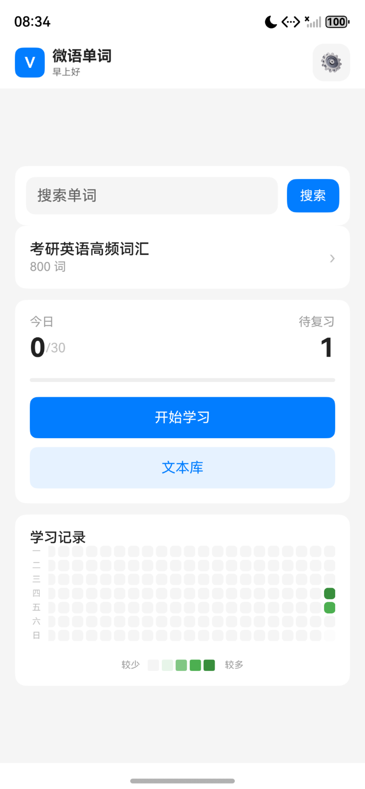
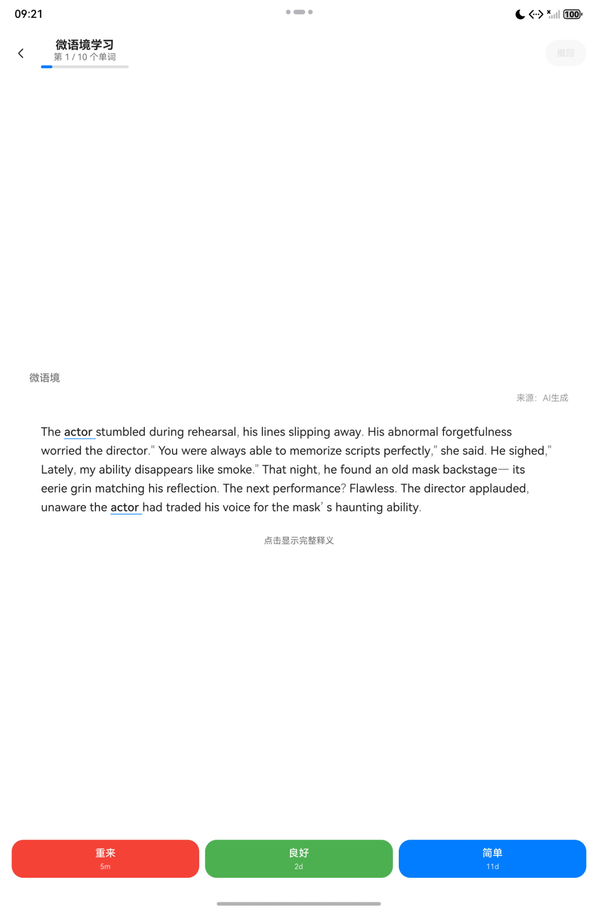
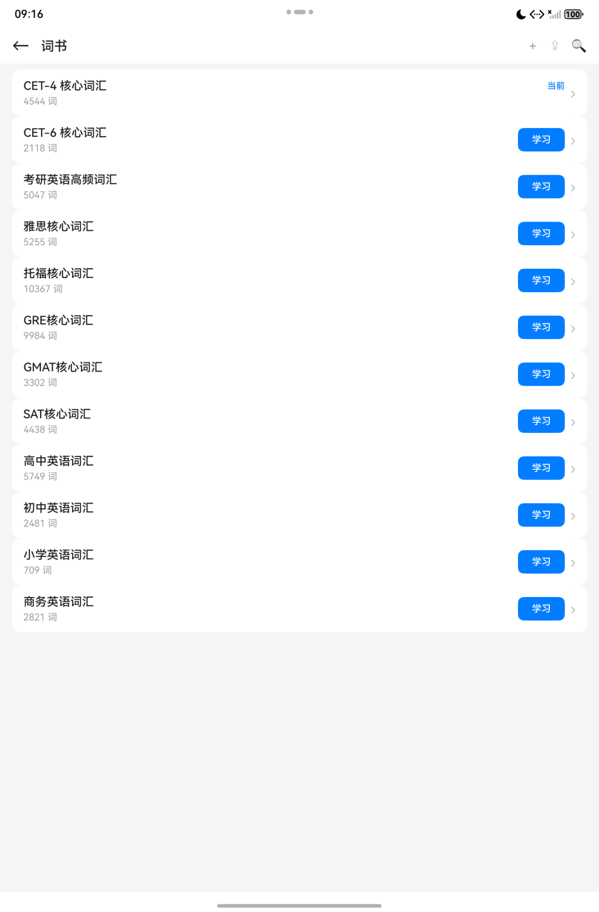

# 微语单词 Vignette

> 情境记忆，轻松学词 - HarmonyOS NEXT 原生单词学习应用

## ✨ 功能特性

- 🎯 **FSRS 间隔重复算法** - 基于最新的 FSRS-6.1.1 标准，科学安排复习计划
- 📖 **AI 情境故事** - 为每个单词生成情境故事，在语境中记忆
- ❄️ **滚雪球语境** - 将已学词汇融入新语境，建立记忆网络
- 📚 **多词书支持** - 内置 CET4/CET6/考研/雅思/托福/GRE 等词书，支持导入自定义词书
- 📝 **文本库阅读** - 导入文章，点击单词即可查询释义
- 🔄 **WebDAV 同步** - 支持多设备数据同步
- 🌙 **深色模式** - 护眼夜间主题
- ⏱️ **时间盒管理** - 科学控制学习时长

## 📱 截图

| 首页 | 学习页 | 词书列表 |
|:---:|:---:|:---:|
|  |  |  |

## 🛠️ 技术栈

- **平台**: HarmonyOS NEXT
- **语言**: ArkTS (TypeScript 扩展)
- **UI 框架**: ArkUI
- **数据库**: RdbStore (SQLite)
- **算法**: FSRS-6.1.1

## 📦 安装

###

### 从源码构建

1. 安装 [DevEco Studio](https://developer.huawei.com/consumer/cn/deveco-studio/)
2. 克隆项目
   ```bash
   git clone https://github.com/CLMC2025/vignette.git
   ```
3. 用 DevEco Studio 打开项目
4. **配置签名证书**（重要！）
   - 本项目的 `build-profile.json5` 已加入 `.gitignore`，不会上传到仓库
   - 你需要配置自己的签名证书才能构建安装包
   - 参考 [HarmonyOS 应用签名指南](https://developer.huawei.com/consumer/cn/doc/harmonyos-guides-V5/ide-signing-V5) 获取证书
   - 在 DevEco Studio 中：`File` → `Project Structure` → `Project` → `Signing Configs`
5. 连接设备或启动模拟器
6. 点击运行

## ⚙️ 配置

### AI 服务配置
本应用需要配置 AI 服务以生成情境故事：
1. 进入「设置」→「API 配置」
2. 选择 AI 服务商（支持深度求索、阿里云、百度等）
3. 输入 API Key
4. 测试连接

### WebDAV 同步配置
1. 进入「设置」→「同步设置」
2. 配置 WebDAV 服务器地址、用户名、密码
3. 点击「测试连接」验证

## 🤝 贡献

欢迎提交 Issue 和 Pull Request！

### 不懂代码？一样可以贡献

- 🐛 帮忙测试，反馈 bug
- 💬 分享你的学习心得
- 🎨 给 UI/UX 提建议
- 🌍 帮忙翻译成其他语言
- 📢 扩散给需要的朋友

### 开发者贡献

1. Fork 本仓库
2. 创建特性分支 (`git checkout -b feature/AmazingFeature`)
3. 提交更改 (`git commit -m 'Add some AmazingFeature'`)
4. 推送到分支 (`git push origin feature/AmazingFeature`)
5. 提交 Pull Request

## 📄 许可证

本项目采用 [GNU AGPL v3](LICENSE) 许可证开源。

## 📮 联系方式

- 邮箱：5@941985.xyz
- QQ群：1077476965

## � 支持项目

如果这个项目对你有帮助，欢迎请我喝杯咖啡 ☕

- [爱发电](https://afdian.com/a/weiyudanci) - 支持开发者持续维护

## �🙏 致谢

- [FSRS Algorithm](https://github.com/open-spaced-repetition/fsrs4anki) - 间隔重复算法
- [Anki](https://github.com/ankitects/anki) - 设计灵感

## 💭 一个特别的备注

这个应用是我在完全不懂编程的情况下，用 AI 辅助完成的第一个鸿蒙项目。它可能不完美，但它代表着一个普通学习者的理想——用自己真正想要的方式，去学语言。

如果你也喜欢这个想法，欢迎提 Issue、提 PR，或者只是进群聊聊你的学习故事。每一个反馈，都会让这个应用变得更好一点点。
